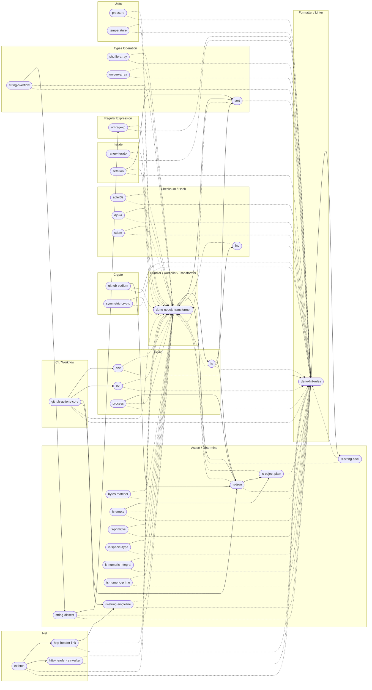

# ES Dependencies Graph

**🕰️ Last Updated:** 2025-03-13 05:50 UTC

> [!NOTE]
> 
> - External dependencies are not rendered.
> - Only the latest release version of the packages are rendered.

```mermaid
flowchart LR
  subgraph GRAPH_Assert["Assert / Determine"]
    bytes-matcher(["bytes-matcher"])
    is-empty(["is-empty"])
    is-json(["is-json"])
    is-object-plain(["is-object-plain"])
    is-primitive(["is-primitive"])
    is-special-type(["is-special-type"])
    is-numeric-integral(["is-numeric-integral"])
    is-numeric-prime(["is-numeric-prime"])
    is-string-ascii(["is-string-ascii"])
    is-string-singleline(["is-string-singleline"])
    string-dissect(["string-dissect"])
  end

  subgraph GRAPH_CI["CI / Workflow"]
    github-actions-core(["github-actions-core"])
  end

  subgraph GRAPH_Compiler["Bundler / Compiler / Transformer"]
    deno-nodejs-transformer(["deno-nodejs-transformer"])
  end

  subgraph GRAPH_Crypto["Crypto"]
    github-sodium(["github-sodium"])
    symmetric-crypto(["symmetric-crypto"])
  end

  subgraph GRAPH_Hash["Checksum / Hash"]
    adler32(["adler32"])
    djb2a(["djb2a"])
    fnv(["fnv"])
    sdbm(["sdbm"])
  end

  subgraph GRAPH_Iterate["Iterate"]
    range-iterator(["range-iterator"])
    setation(["setation"])
  end

  subgraph GRAPH_Linter["Formatter / Linter"]
    deno-lint-rules(["deno-lint-rules"])
  end

  subgraph GRAPH_Net["Net"]
    exfetch(["exfetch"])
    http-header-link(["http-header-link"])
    http-header-retry-after(["http-header-retry-after"])
  end

  subgraph GRAPH_RegExp["Regular Expression"]
    url-regexp(["url-regexp"])
  end

  subgraph GRAPH_System["System"]
    env(["env"])
    eol(["eol"])
    fs(["fs"])
    process(["process"])
  end

  subgraph GRAPH_Types_Operation["Types Operation"]
    shuffle-array(["shuffle-array"])
    sort(["sort"])
    string-overflow(["string-overflow"])
    unique-array(["unique-array"])
  end

  subgraph GRAPH_Units["Units"]
    pressure(["pressure"])
    temperature(["temperature"])
  end

  deno-lint-rules --> is-string-ascii
  deno-nodejs-transformer --> fs
  deno-nodejs-transformer --> is-json
  deno-nodejs-transformer --> sort
  exfetch --> http-header-link
  exfetch --> http-header-retry-after
  fs --> fnv
  fs --> is-json
  fs --> sort
  github-actions-core --> env
  github-actions-core --> eol
  github-actions-core --> is-json
  github-actions-core --> is-string-singleline
  github-sodium --> is-json
  http-header-link --> is-string-singleline
  http-header-retry-after
  is-empty --> is-object-plain
  is-json --> is-object-plain
  process --> is-json
  setation --> sort
  string-dissect --> url-regexp
  string-overflow --> string-dissect

  adler32 -.-> deno-nodejs-transformer
  bytes-matcher -.-> deno-nodejs-transformer
  djb2a -.-> deno-nodejs-transformer
  env -.-> deno-nodejs-transformer
  eol -.-> deno-nodejs-transformer
  exfetch -.-> deno-nodejs-transformer
  fnv -.-> deno-nodejs-transformer
  fs -.-> deno-nodejs-transformer
  github-actions-core -.-> deno-nodejs-transformer
  github-sodium -.-> deno-nodejs-transformer
  http-header-link -.-> deno-nodejs-transformer
  http-header-retry-after -.-> deno-nodejs-transformer
  is-empty -.-> deno-nodejs-transformer
  is-json -.-> deno-nodejs-transformer
  is-numeric-integral -.-> deno-nodejs-transformer
  is-numeric-prime -.-> deno-nodejs-transformer
  is-object-plain -.-> deno-nodejs-transformer
  is-primitive -.-> deno-nodejs-transformer
  is-special-type -.-> deno-nodejs-transformer
  is-string-ascii -.-> deno-nodejs-transformer
  is-string-singleline -.-> deno-nodejs-transformer
  pressure -.-> deno-nodejs-transformer
  process -.-> deno-nodejs-transformer
  range-iterator -.-> deno-nodejs-transformer
  sdbm -.-> deno-nodejs-transformer
  setation -.-> deno-nodejs-transformer
  shuffle-array -.-> deno-nodejs-transformer
  sort -.-> deno-nodejs-transformer
  string-dissect -.-> deno-nodejs-transformer
  string-overflow -.-> deno-nodejs-transformer
  symmetric-crypto -.-> deno-nodejs-transformer
  temperature -.-> deno-nodejs-transformer
  unique-array -.-> deno-nodejs-transformer
  url-regexp -.-> deno-nodejs-transformer

  adler32 -.-> deno-lint-rules
  bytes-matcher -.-> deno-lint-rules
  djb2a -.-> deno-lint-rules
  env -.-> deno-lint-rules
  eol -.-> deno-lint-rules
  exfetch -.-> deno-lint-rules
  fnv -.-> deno-lint-rules
  fs -.-> deno-lint-rules
  github-actions-core -.-> deno-lint-rules
  github-sodium -.-> deno-lint-rules
  http-header-link -.-> deno-lint-rules
  http-header-retry-after -.-> deno-lint-rules
  is-empty -.-> deno-lint-rules
  is-json -.-> deno-lint-rules
  is-numeric-integral -.-> deno-lint-rules
  is-numeric-prime -.-> deno-lint-rules
  is-object-plain -.-> deno-lint-rules
  is-primitive -.-> deno-lint-rules
  is-special-type -.-> deno-lint-rules
  is-string-ascii -.-> deno-lint-rules
  is-string-singleline -.-> deno-lint-rules
  pressure -.-> deno-lint-rules
  process -.-> deno-lint-rules
  range-iterator -.-> deno-lint-rules
  sdbm -.-> deno-lint-rules
  setation -.-> deno-lint-rules
  shuffle-array -.-> deno-lint-rules
  sort -.-> deno-lint-rules
  string-dissect -.-> deno-lint-rules
  string-overflow -.-> deno-lint-rules
  symmetric-crypto -.-> deno-lint-rules
  temperature -.-> deno-lint-rules
  unique-array -.-> deno-lint-rules
  url-regexp -.-> deno-lint-rules
```
