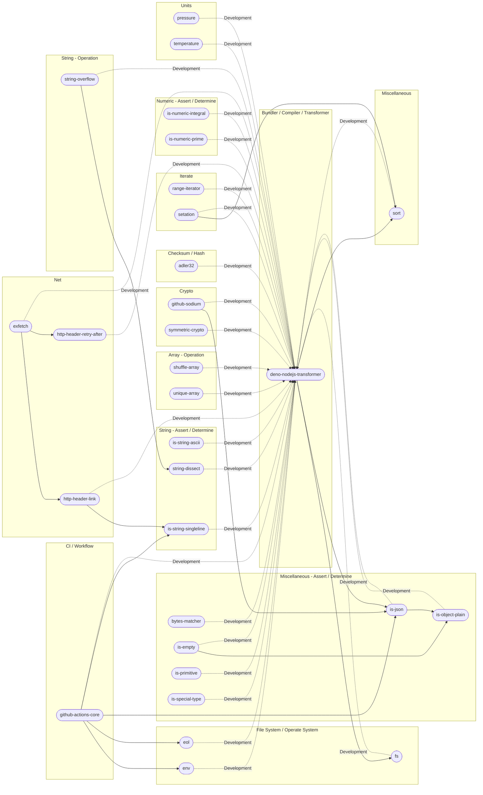

# ES Dependencies Graph

**🕰️ Last Updated:** 2024-12-19 10:25 UTC

> [!NOTE]
>
> - External dependencies are not rendered.
> - Only the latest release version of the packages are rendered.

```mermaid
%%{init: {"flowchart": {"htmlLabels": false}} }%%
flowchart LR
  subgraph GRAPH_Array_Operation ["Array - Operation"]
    shuffle-array(["shuffle-array"])
    unique-array(["unique-array"])
  end

  subgraph GRAPH_CI ["CI / Workflow"]
    github-actions-core(["github-actions-core"])
  end

  subgraph GRAPH_Compiler ["Bundler / Compiler / Transformer"]
    deno-nodejs-transformer(["deno-nodejs-transformer"])
  end

  subgraph GRAPH_Crypto ["Crypto"]
    github-sodium(["github-sodium"])
    symmetric-crypto(["symmetric-crypto"])
  end

  subgraph GRAPH_Hash ["Checksum / Hash"]
    adler32(["adler32"])
  end

  subgraph GRAPH_Iterate ["Iterate"]
    range-iterator(["range-iterator"])
    setation(["setation"])
  end

  subgraph GRAPH_Misc_Assert ["Miscellaneous - Assert / Determine"]
    bytes-matcher(["bytes-matcher"])
    is-empty(["is-empty"])
    is-json(["is-json"])
    is-object-plain(["is-object-plain"])
    is-primitive(["is-primitive"])
    is-special-type(["is-special-type"])
  end

  subgraph GRAPH_Net ["Net"]
    exfetch(["exfetch"])
    http-header-link(["http-header-link"])
    http-header-retry-after(["http-header-retry-after"])
  end

  subgraph GRAPH_Numeric_Assert ["Numeric - Assert / Determine"]
    is-numeric-integral(["is-numeric-integral"])
    is-numeric-prime(["is-numeric-prime"])
  end

  subgraph GRAPH_System ["File System / Operate System"]
    env(["env"])
    eol(["eol"])
    fs(["fs"])
  end

  subgraph GRAPH_String_Assert ["String - Assert / Determine"]
    is-string-ascii(["is-string-ascii"])
    is-string-singleline(["is-string-singleline"])
    string-dissect(["string-dissect"])
  end

  subgraph GRAPH_String_Operation ["String - Operation"]
    string-overflow(["string-overflow"])
  end

  subgraph GRAPH_Units ["Units"]
    pressure(["pressure"])
    temperature(["temperature"])
  end

  subgraph GRAPH_Misc ["Miscellaneous"]
    sort(["sort"])
  end

  deno-nodejs-transformer --> fs
  deno-nodejs-transformer --> is-json
  deno-nodejs-transformer --> sort
  exfetch --> http-header-link
  exfetch --> http-header-retry-after
  github-actions-core --> env
  github-actions-core --> eol
  github-actions-core --> is-json
  github-actions-core --> is-string-singleline
  github-sodium --> is-json
  http-header-link --> is-string-singleline
  http-header-retry-after
  is-empty --> is-object-plain
  is-json --> is-object-plain
  setation --> sort
  string-overflow --> string-dissect

  adler32 -. Development .-> deno-nodejs-transformer
  bytes-matcher -. Development .-> deno-nodejs-transformer
  env -. Development .-> deno-nodejs-transformer
  eol -. Development .-> deno-nodejs-transformer
  exfetch -. Development .-> deno-nodejs-transformer
  fs -. Development .-> deno-nodejs-transformer
  github-actions-core -. Development .-> deno-nodejs-transformer
  github-sodium -. Development .-> deno-nodejs-transformer
  http-header-link -. Development .-> deno-nodejs-transformer
  http-header-retry-after -. Development .-> deno-nodejs-transformer
  is-empty -. Development .-> deno-nodejs-transformer
  is-json -. Development .-> deno-nodejs-transformer
  is-numeric-integral -. Development .-> deno-nodejs-transformer
  is-numeric-prime -. Development .-> deno-nodejs-transformer
  is-object-plain -. Development .-> deno-nodejs-transformer
  is-primitive -. Development .-> deno-nodejs-transformer
  is-special-type -. Development .-> deno-nodejs-transformer
  is-string-ascii -. Development .-> deno-nodejs-transformer
  is-string-singleline -. Development .-> deno-nodejs-transformer
  pressure -. Development .-> deno-nodejs-transformer
  range-iterator -. Development .-> deno-nodejs-transformer
  setation -. Development .-> deno-nodejs-transformer
  shuffle-array -. Development .-> deno-nodejs-transformer
  sort -. Development .-> deno-nodejs-transformer
  string-dissect -. Development .-> deno-nodejs-transformer
  string-overflow -. Development .-> deno-nodejs-transformer
  symmetric-crypto -. Development .-> deno-nodejs-transformer
  temperature -. Development .-> deno-nodejs-transformer
  unique-array -. Development .-> deno-nodejs-transformer
```
